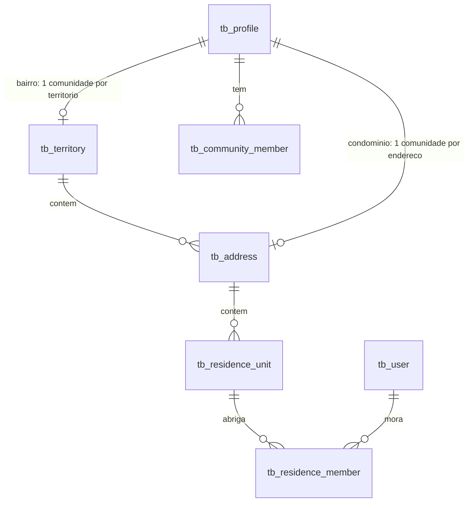
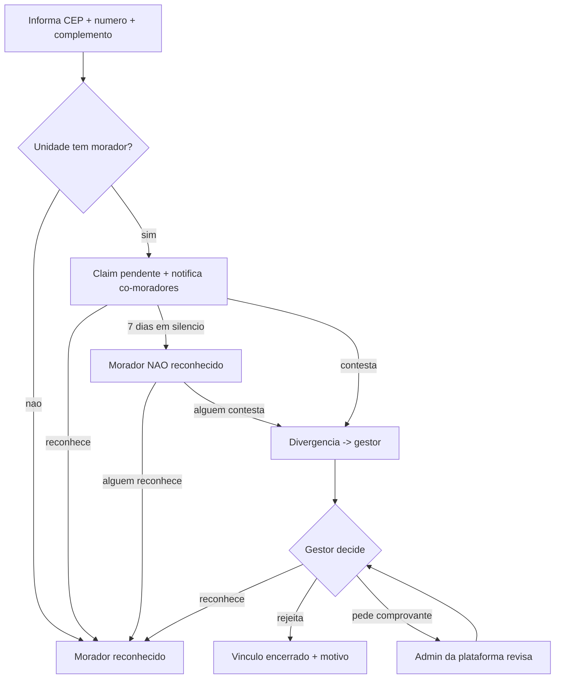

# Comunidades territoriais — pertencimento real, residência e privacidade estrutural

**Data:** 2026-08-09
**Status:** DESENHO MACRO APROVADO — nada implementado. Cada subsistema da §14 vira spec próprio antes de virar código.
**Escopo:** bairro (novo), condomínio (evolução da mig 196), temática (comunidade comum existente).
**Fora de escopo:** academia (desenho próprio depois), regras comerciais de anunciante externo, fórmula do ranking interno.

---

## 1. O que este documento é

Um mapa de arquitetura. Ele fixa o **modelo de domínio**, as **fronteiras de autorização**, a
**estratégia de endereço**, a **análise de ameaças** e a **ordem** em que os subsistemas devem ser
construídos. Ele **não** desce a slices, endpoints ou SQL — isso é trabalho dos specs derivados.

A razão de existir: o pedido original contém pelo menos cinco subsistemas independentes. Um spec
único produziria um documento que ninguém consegue executar com segurança.

---

## 2. Estado atual

### 2.1 O que já existe e é reaproveitado

| Peça | Onde | Papel no novo desenho |
|---|---|---|
| Comunidade = perfil | `tb_profile.is_community` (mig 154) | Base das 3 modalidades |
| Membros user-level | `tb_community_member` (leader/vice/member) | Papéis administrativos |
| Modalidade | `tb_profile.community_kind` (mig 196) | Eixo onde `neighborhood` entra |
| Privacidade | `community_privacy` + mensalidade (mig 173) | Desacoplada em §5 |
| Post exclusivo | `id_exclusive_community` (mig 173) | Feed interno já não vaza |
| Território | `tb_region` / `tb_region_city` (migs 121–123, IBGE completo) | Resolução de região |
| ViaCEP | `src/integrations/viacep/lookup.js` | Resolução CEP → bairro (§6) |
| Máscara de endereço | `src/utils/condoRules.js` | Semente da política de modalidade |
| Reivindicação | `tb_condo_claim` (mig 196) | Evolui para reconhecimento/contestação (§7) |
| Votação de liderança | `tb_community_leadership_vote` (mig 156) | Reusada inteira; só o **gatilho** muda (§9) |
| Área comercial interna | `tb_condo_listing` + slots (mig 198) | Reusada; fronteira reforçada (§12) |
| Antifraude | `utils/fraudScore.js` + `tb_fraud_review` (mig 201) | Recebe sinais territoriais (§10) |
| Notificações | `tb_notification` com CHECK superset (mig 153) | Tipos novos entram como superset |

### 2.2 Conflitos entre a visão e o código em produção

Estes são reais e estavam no ar quando este documento foi escrito.

| # | Conflito | Evidência |
|---|---|---|
| **C1** | Listagem pública devolve `member_count`, `xp_total`, `xp_level` para **qualquer visitante**, inclusive condomínio | `CommunityStorage.listPublic` / `getById` |
| **C2** | `GET /communities/:id/goal` **não tem middleware de auth** e devolve nome, @, avatar e nível de até 20 membros | `communityPublic.routes.js` + `CommunityService._assembleGoal` |
| **C3** | `GET /communities/:id/members` só tem gate em condomínio — comunidade **privada paga** entrega a lista a qualquer um | `CommunityService.getMembers` |
| **C4** | Condomínio é pesquisável por **rua** (`ILIKE` em `condo_street`) → enumeração de endereço | `CommunityStorage.listPublic` |
| **C5** | CHECK obriga `is_community ⇒ id_machine NOT NULL` — bairro não tem enxame | `chk_profile_clan_taxonomy` |
| **C6** | Exclusividade por categoria × teto vendável (`tb_community_entitlement`) são eixos diferentes | mig 154 |
| **C7** | `leave` faz `DELETE` do vínculo — **apaga o rastro**, então não há onde apoiar carência | `CommunityService.leave` |
| **C8** | Academia reimplementou membros, feed, metas e ranking fora de comunidade | `tb_academy` (mig 176) — **fora deste desenho** |
| **C9** | Fundador é dono permanente na prática ("o líder não pode sair") | `CommunityService.leave` |
| **E1** | Unidade tem **titular único**; aprovar reivindicação **remove** o morador anterior em silêncio | `CondoService.decideClaim` → `setUnitHolder` |

### 2.3 O que não existe

Bairro como território reconhecido (o IBGE cobre municípios, **não bairros**) · residência do usuário
fora do condomínio · verificação endereço↔território · residência compartilhada · reconhecimento e
contestação entre moradores · comprovante de residência · histórico e carência de troca · sinais de
fraude territoriais.

---

## 3. Decision Log

| # | Decisão | Consequência |
|---|---|---|
| D1 | Desenho macro antes de spec | Specs derivam daqui, um por subsistema |
| D2 | Academia **fora** | Restrição: a camada de pertencimento aceita academia depois **sem reescrita** |
| D3 | Território = `(UF, município, bairro)` normalizado | Base própria semeada por CEP + curadoria admin |
| D3′ | Bairro **nunca é digitado** — sempre derivado do CEP | Conjunto fechado de strings dos Correios; de-duplicação vira curadoria residual |
| D4 | Residência guarda **CEP + número + complemento** | Sem logradouro nem bairro por extenso — derivados do CEP com cache |
| D5 | Descoberta por **(cidade, bairro)**, nunca por rua | Resolve C4 e C1 mantendo a vitrine viva |
| D6 | Silêncio ⇒ **morador não reconhecido** | Dois níveis de vínculo |
| D7 | Carência (~3 meses) restringe a **próxima entrada** | Saída sempre livre; válvulas por motivo (§8) |
| D8 | Governança: **petição + inatividade** | Ambas abrem a votação existente |
| D9 | **Privacidade ⊥ cobrança** | Territorial nasce privado e **grátis**; temática privada segue paga |
| D10 | Condomínio: gestor **gera a planta** (torres × andares × aptos), depois edita | Inverte a mig 196; morador escolhe da grade |
| D11 | Residência é **árvore**: endereço → unidade | Vale para bairro **e** condomínio |
| D12 | Unidade de bairro nasce sob demanda; de condomínio, do gerador | Endereço registrado depois como condomínio **adota** as unidades existentes |
| D13 | Comprovante é lido pelo **admin da plataforma**, não pelo gestor | Gestor de bairro é vizinho; vê só o veredito |
| D14 | Mudança de endereço é válvula da carência **mediante comprovante** | Sem isso a carência morreria (toda troca de bairro é troca de endereço) |

**Abordagem escolhida:** camada de pertencimento **extraída** — um núcleo que as modalidades
consomem, em vez de bairro herdar o código do condomínio (que carregaria o titular único junto) ou
nascer em tabelas paralelas (o erro que o projeto já pagou duas vezes: academia e `/account`).

---

## 4. Modelo de domínio

### 4.1 Entidades novas

| Entidade | Papel | Unicidade |
|---|---|---|
| `tb_territory` | O bairro reconhecido. Rótulo de exibição separado da forma normalizada; `status` marca fusão | `(uf, municipio_norm, bairro_norm)` |
| `tb_address` | Endereço físico `(cep, número)`, pertencente a um território. Pode apontar para um perfil-condomínio | `(cep, numero_norm)` |
| `tb_residence_unit` | A unidade dentro do endereço (o complemento). **Absorve `tb_condo_unit`**. `source` distingue gerada × sob demanda | `(id_address, bloco, label_norm)` |
| `tb_residence_member` | Vínculo **N:N** morador↔unidade, com `status ∈ {não_reconhecido, reconhecido, contestado}` | `(id_unit, id_user)` |
| `tb_membership_history` | Toda entrada e saída de comunidade **com o motivo** — base da carência | — |
| `tb_community_petition` (+ assinaturas) | Gatilho de governança por petição | — |
| `tb_cep_cache` | Resiliência do ViaCEP | `cep` |



### 4.2 O predicado que amarra o sistema

> **Morador** é o usuário com vínculo `reconhecido` numa unidade cujo endereço pertence ao **escopo**
> da comunidade.

Muda apenas o escopo: **bairro** → o território; **condomínio** → o endereço. Uma definição, duas
resoluções. É o que permitirá academia plugar depois (escopo = matrícula ativa) sem reescrita — a
restrição do D2.

### 4.3 Unicidade territorial por índice

- `UNIQUE (id_territory) WHERE community_kind = 'neighborhood'` → **uma** comunidade oficial por bairro.
- `UNIQUE (id_condo_profile)` em `tb_address` → **um** condomínio por endereço.

Dois fundadores simultâneos viram violação de constraint tratada, não duas comunidades.

### 4.4 Resolução do C5

O CHECK `chk_profile_clan_taxonomy` é relaxado para aceitar `id_machine NULL` em modalidades
territoriais. Hoje **até condomínio carrega um enxame** apenas para satisfazer o CHECK — a mesma
patologia da "categoria fantasma" que a mig 200 resolveu no perfil-conta.

---

## 5. Fronteiras de autorização

### 5.1 Escada de tiers

Resolvida **uma vez por requisição**, num contexto compartilhado (o `_context` do `CondoService`
generalizado para todas as modalidades):

```
anônimo → forasteiro → candidato → membro → morador não reconhecido → morador → gestor → admin
```

### 5.2 Política de modalidade

Uma tabela declarativa em código responde, dada a modalidade: como é descoberta · se expõe contagens ·
tier mínimo para ler feed / escrever / ver vizinhos / votar / anunciar · se exige residência · grupo
de exclusividade · se conta no teto vendável · se é monetizável · visibilidade de endereço.

**Efeito prático: `kind === 'condo'` desaparece do código de negócio.** Hoje a regra de privacidade é
o literal `privacy === 'private' || kind === 'condo'` repetido em vários guards — e é exatamente
assim que C2 e C3 nasceram: alguém escreveu um guard novo e esqueceu do `OR`.

| | temática pública | temática privada | **bairro** | **condomínio** |
|---|---|---|---|---|
| Descoberta | busca aberta | busca aberta | (cidade, bairro) | (cidade, bairro) |
| Expõe contagem | sim | **não** | **não** | **não** |
| Exige residência | não | não | **sim** | **sim** |
| Lê feed | qualquer um | membro | **morador não reconhecido** | **morador não reconhecido** |
| Escreve no feed | membro | membro | **morador** | **morador** |
| Vê lista de vizinhos | qualquer um | membro | **morador** | **morador** (unidade alheia: só gestor) |
| Vota | membro | membro | **morador** | **morador** |
| Anuncia | — | — | **morador** | **morador** |
| Exclusividade | nenhuma | nenhuma | `neighborhood` | `condo` |
| Conta no teto vendável | sim | sim | **não** | **não** |
| Monetizável | não | **sim** | **não** (D9) | **não** (D9) |
| Endereço visível | — | — | território | rua só p/ morador |

### 5.3 Projeção por audiência — a rede de segurança

Nenhuma leitura sai sem passar por um recorte por tier, com **negação por padrão**: campo não listado
para aquele tier **não existe** no objeto de saída.

Essa é a diferença que importa. Um checador de permissão não teria pego o C2, porque ninguém chamou
checador nenhum — a rota simplesmente não tem middleware. Um projetor pega, porque a saída passa por
ele **obrigatoriamente**. `member_count` deixa de vazar porque a projeção de forasteiro não tem esse
campo, não porque alguém lembrou de removê-lo.

Consequências nas rotas: em modalidade territorial, `optionalAuth` deixa de devolver dado; `/goal` e
`/benchmark` passam a exigir tier mínimo.

---

## 6. Estratégia de endereço e validação territorial

### 6.1 Fluxo

O usuário informa **CEP + número (+ complemento)** → ViaCEP resolve bairro/cidade/UF → território é
encontrado ou criado por `(uf, municipio_norm, bairro_norm)` → região sai de `tb_region_city` (pode
ficar NULL sem quebrar, como já acontece na mig 200) → tudo cacheado em `tb_cep_cache`.

Normalização reusa `fl_norm_city()` (mig 121), que já remove acento e caixa sem depender da extensão
`unaccent`.

### 6.2 O que "verificação razoável" significa aqui

**Nenhuma fonte externa gratuita confirma que você mora no número 123.** O ViaCEP valida o CEP e o
logradouro — não o número, muito menos o apartamento. Isso não é limitação a contornar; é o que
define o modelo:

| Camada | O que prova | Como |
|---|---|---|
| Território | Que o endereço existe e pertence àquele bairro | ViaCEP — **externo e forte** |
| Unidade | Que **você** mora ali | **Social e progressivo** — reconhecimento dos co-moradores; documento só em divergência |

A máquina garante o **onde**; as pessoas garantem o **quem**. É a "verificação razoável sem base
previamente perfeita" do enunciado.

### 6.3 Alternativas descartadas

| Alternativa | Por que não |
|---|---|
| Faixa de CEP como território | Não corresponde a bairro nenhum; ninguém se identifica como morador do "01310" |
| Curadoria total do admin | Exige cadastrar o Brasil à mão antes da primeira comunidade existir |
| Município como território | Comunidade de bairro em São Paulo viraria comunidade de 11 milhões |
| Geocodificação (Nominatim/Google) | Custo ou restrição de uso, e dependência externa em caminho crítico |

### 6.4 Degradação

1. **Cidade com CEP único** (boa parte dos municípios pequenos): ViaCEP devolve sem bairro → o
   território nasce marcado como **abrangente da cidade**, em vez de o cadastro travar.
2. **ViaCEP fora do ar:** cache primeiro; em miss, o cadastro **é aceito** em estado pendente de
   verificação (usuário entra como morador não reconhecido) e reprocessa depois. Serviço público sem
   SLA nunca bloqueia entrada.
3. **CEP inexistente ou malformado:** recusa imediata — o único caso que trava, e trava certo.

---

## 7. Verificação progressiva

| Degrau | Situação | O que acontece |
|---|---|---|
| 0 | Unidade vazia | Vira morador **reconhecido** na hora. Zero fricção — é o caso comum |
| 1 | Unidade ocupada | Claim pendente; co-moradores reconhecidos notificados. Um **reconhece** → reconhecido |
| 2 | Ninguém responde em 7 dias | Entra como **morador não reconhecido**: lê o feed; não publica, não vota, não anuncia, não vê vizinhos |
| 3 | Um co-morador **contesta** | Abre divergência → gestor |
| 4 | Gestor pede comprovante | Upload privado, veredito humano |



### 7.1 O invariante

**Nenhum degrau remove morador existente automaticamente.** Remoção só por decisão humana explícita,
com motivo registrado.

Isso inverte o comportamento atual do condomínio, onde aprovar transfere a titularidade e o morador
anterior perde a unidade em silêncio (E1). Vem direto do enunciado: *"reconhecimento não deve remover
moradores anteriores"*.

### 7.2 Comprovante

Lido pelo **admin da plataforma**, não pelo gestor (D13) — o gestor de bairro é um vizinho, e
entregar a ele a conta de luz alheia transformaria a governança local em coleta de documentos. O
gestor vê apenas o veredito. Arquivo no R2 apagado **em até 30 dias após a decisão**; só o veredito
persiste.

### 7.3 Contestação não pode virar arma

Contestar **não remove** ninguém — apenas marca divergência. Contestação em série vira sinal
antifraude (§10), e o histórico de contestações é visível para quem decide.

---

## 8. Exclusividade, carência e histórico

**Exclusividade** sai de índice, não de código: `exclusivity_group` desnormalizado no vínculo, com
`UNIQUE (id_user, exclusivity_group) WHERE exclusivity_group IS NOT NULL`. Bairro e condomínio recebem
grupos distintos; **temática recebe NULL** e segue governada pelo teto vendável de hoje — resolve C6
sem tocar no que já é vendido.

**Carência** lê `tb_membership_history`, que resolve C7 (hoje o `DELETE` apaga o rastro). Ao sair,
grava-se motivo e `cooldown_until`; a próxima entrada na mesma categoria consulta.

### 8.1 O problema do D7 e a saída

Para entrar no bairro B é preciso declarar residência em B. Logo **toda troca de bairro é troca de
endereço** — e se "mudou de endereço" fosse válvula livre, a carência morreria no nascimento. Mas
travar quem se mudou de verdade por 3 meses também não serve.

Saída (D14): **mudança é válvula, mediante comprovante** — o mesmo mecanismo do degrau 4. Quem
realmente mudou tem documento e passa; quem só digitou outro CEP não passa.

**Válvulas finais:** expulsão · divergência decidida contra · correção de erro cadastral em até 24h ·
intervenção administrativa · **mudança comprovada por documento**.

---

## 9. Governança

- **Petição** — 20% dos moradores **reconhecidos** (mínimo 3) assinam; atingido o quórum, abre a
  votação de 7 dias já existente, sem alterar o mecanismo (líder × desafiante, maioria simples,
  empate mantém, derrotado vira vice).
- **Inatividade** — gestor sem decidir nada por 30 dias **com fila pendente** → cargo vago → qualquer
  morador reconhecido se candidata; havendo mais de um, votação.
- **Fundador ≠ dono** (resolve C9): "o líder não pode sair" vira "o gestor pode sair; o cargo fica
  vago e a sucessão abre". Nenhuma regra protege o fundador.
- **Quem vota:** só morador **reconhecido**. Não reconhecido é leitor.
- O gatilho por XP fica desligado nas territoriais — onde, aliás, nunca dispararia, já que elas estão
  fora do ranking de comunidades.

---

## 10. Antifraude territorial

Códigos novos em `utils/fraudScore.js`, com a **regra de ouro intacta**: pontuam e enfileiram para
revisão humana, **nunca bloqueiam**.

| Código | Dispara quando |
|---|---|
| `residence_churn` | Trocas de residência acima do normal na janela |
| `contested_claim` | Reivindicação contestada por co-morador |
| `serial_contester` | Usuário que contesta muita gente (protege contra a contestação usada como arma) |
| `territory_hopping` | Entrada em várias comunidades territoriais distintas na janela |
| `overcrowded_unit` | Número implausível de moradores na mesma unidade |

**Calibração obrigatória:** nenhum peso individual pode cruzar o limiar de 30 sozinho. Família
dividindo casa é normal; mudar de cidade é normal; república de estudantes é normal. Todos ≤ 25 —
combinação abre revisão, sinal isolado não.

Usuário já bloqueado no painel (`tb_user.blocked_at`, mig 201) não reivindica residência.

---

## 11. Análise de ameaças

| Ameaça | Vetor | Mitigação |
|---|---|---|
| Enumerar comunidades | Busca por (cidade, bairro) | **Aceito** (D5) — sem contagem, membros ou atividade. Rate limit |
| Enumerar endereços | `ILIKE` em `condo_street` (C4) | Rua sai da busca |
| Descobrir quem mora onde | `/members`, `/goal`, `/benchmark` | Projeção por audiência; `/goal` deixa de ser público |
| Claim como oráculo | Reivindicar sonda se a unidade está ocupada | Resposta de forma uniforme + teto de **3 reivindicações por usuário/dia** e 1 por unidade. **Risco residual assumido**: o tempo até a resolução ainda distingue os casos — informação de baixo valor, mas registrada em vez de escondida |
| Vazar por cache/URL | Página cacheada, rota SEO | `no-store` nas territoriais; rota SEO nunca as renderiza |
| Vazar por log | `runWithLogs` grava meta | CEP, número e complemento **nunca** entram em log |
| Vazar por notificação | Aviso direcionado a uma unidade | O corpo nunca cita a unidade de terceiro |
| Anunciante ver morador | Área comercial interna | Anúncio se liga à **comunidade**, jamais ao morador; métrica só agregada |
| Contestação como arma | Vizinho hostil bloqueia entrada | Não remove ninguém; `serial_contester`; histórico visível a quem decide |

### 11.1 Casos de borda resolvidos

- **Condomínio dentro de bairro** — cai de graça: o endereço do condomínio pertence a um território,
  então o morador do prédio é elegível ao bairro automaticamente. Grupos de exclusividade distintos,
  os dois vínculos convivem.
- **Fusão de territórios com duas comunidades** — o índice único **obriga** o admin a decidir qual
  sobrevive, em vez de o banco recusar em silêncio.
- **Morador que se mudou e não saiu** — o gestor remove com motivo `moved`; a carência não se aplica
  a quem foi removido.
- **Unidade que ficou vazia** — volta a ser livre (degrau 0 para o próximo).
- **Condomínio irregular** (torre com andares diferentes, sem 13º, cobertura, loja) — o gerador do
  D10 é ponto de partida, **não verdade**: o gestor edita, remove e acrescenta unidades depois.

---

## 12. Áreas internas e fronteira comercial

Feed interno, ranking interno, avisos, governança, serviços e produtos reaproveitam o que existe:
o feed usa `id_exclusive_community` (mig 173), o ranking interno reusa a máquina de meta/temporada
(`tb_community_goal`) restrita a membros, avisos e enquetes reusam `tb_condo_notice` / `tb_condo_poll`,
e a área comercial reusa `tb_condo_listing` + slots (mig 198).

**Restrição de arquitetura, não de política:** o anúncio se liga à **comunidade**, jamais ao morador.
Não existe caminho de leitura de entidade comercial para `tb_residence_member`. Métrica de exposição
é sempre agregada. As regras comerciais (preços, períodos, quem pode anunciar de fora) ficam
deliberadamente em aberto — o que este desenho garante é que defini-las depois **não** abre acesso a
dado de morador.

---

## 13. Compatibilidade, migrations e rollback

- Seis a sete migrations **idempotentes**, na ordem da §14.
- **Nenhum `DROP` de tabela.** `tb_condo_unit` é absorvida por backfill; colunas antigas viram
  derivadas/legado — o padrão da mig 190, que já provou funcionar.
- CHECK de `tb_notification` reescrito como **superset** (regra da mig 153).
- Flag nova `bairro` como kill-switch; `condominio` permanece.
- **Rollback:** cada passo é desligável por flag. O único com risco real de dados — a migração do
  condomínio — roda por **último**, com o núcleo já validado em produção com dados novos.
- **Quebra de contrato a anunciar:** remover `member_count` e XP das respostas públicas **quebra o
  frontend atual**. Backend e frontend do passo 1 saem juntos.

---

## 14. Ordem dos subsistemas

| # | Subsistema | Por que nesta posição |
|---|---|---|
| **1** | Blindagem de privacidade (C1–C4) | Vazamentos **ativos hoje**, atingem comunidades já criadas, não dependem de decisão pendente. Introduz política + projeção sem tocar em modelo de dados |
| **2** | Território + endereço + unidade (a árvore) | Estrutura nova, ninguém depende dela. Nasce isolada e testável |
| **3** | Vínculo, reconhecimento, contestação, comprovante | Alicerce do D6. Ainda sem migrar condomínio |
| **4** | Bairro ponta a ponta | Primeira modalidade a usar o núcleo inteiro. Valida com dados reais antes de arriscar dados antigos |
| **5** | Migração do condomínio para o núcleo | Por último, com o núcleo provado. Aqui entram o gerador do D10 e a absorção de `tb_condo_unit` |
| **6** | Governança (petição + inatividade) e áreas internas | Depende de morador confirmado existir nas duas modalidades |

Se algo der errado nos passos 2–4, **nenhum condomínio existente foi tocado**. E o passo 1 entrega
valor de segurança imediato, independente de todo o resto.

---

## 15. Questões em aberto

| # | Questão | Quando decidir |
|---|---|---|
| Q1 | **Conta supervisionada** (mig 061) pode reivindicar residência? Menor de idade num bairro privado | Antes do spec do subsistema 3 |
| Q2 | Quantas unidades um usuário pode ter na mesma comunidade (segunda casa, imóvel alugado) | Spec do subsistema 3 |
| Q3 | Fórmula do ranking interno (o que pontua num bairro) | Spec do subsistema 6 |
| Q4 | Regras comerciais de anunciante externo (preço, período, quem anuncia de fora) | Depois do subsistema 6 |
| Q5 | Academia: como implementa o contrato de pertencimento | Desenho próprio |
| Q6 | Quórum exato da petição (20%/mín. 3) e janela de inatividade (30 d) — calibrar com dados reais | Spec do subsistema 6 |
| Q8 | Pesos e janelas dos 5 sinais territoriais (§10) — só a regra "nenhum ≥ 30 sozinho" está fixada | Spec do subsistema 3, revisar com dados do painel |
| Q7 | O que fazer com unidades duplicadas por variação de digitação nos condomínios existentes | Spec do subsistema 5 |
